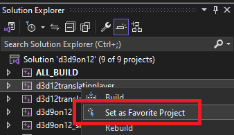
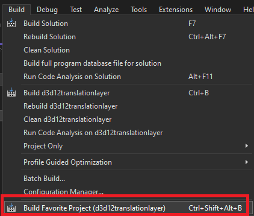
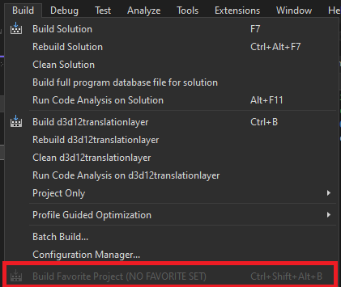

# ExtendedShortcuts
ExtendedShortcuts is a VisualStudio 2022 extension intnded to provide shortcuts to various tasks in the development workflow.
Initial functionality is simply to solve a common pain point for me: building a favorite project via hotkey rather than finding it from the list of projects.

## BuildFavoriteProject
Right click a project in your solution heirarchy and click Set as Favorite Project

Once a favorite has been set, you can build it via Build > Build Favorite Project or press the hotkey (`CTRL+SHIFT+ALT+B` by default). My appologies for the default keybind, but I already use the more sane options. Feel free to rebind `ExtendedShortcuts.BuildFavoriteProject` to your preference.

If no favorite is set, the command will be disabled

**Note that, as of right now, no data is stored between editor instances - if you close the editor, your favorite project will be forgotten.**